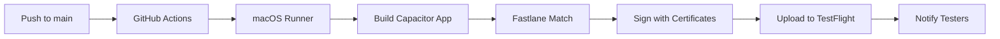

# iOS TestFlight Deployment Guide

## Executive Summary

Building and signing an iOS binary always requires Apple's tool-chain (Xcode CLI + security utilities) and an active Apple Developer membership; however, those bits can live entirely on GitHub's macos-latest runners—you don't need a personal MacBook or to open the Xcode GUI.

Your Linux laptop stays the web-code workspace; GitHub Actions drives a headless macOS build that Fastlane signs and uploads to TestFlight. Manual work is limited to:

1. Enrolling in the Apple Developer Program
2. Performing one-time App Store Connect setup (bundle ID, API key, certificates repo password)  
3. Adding secrets to your GitHub repo

Everything else—Capacitor sync, Xcode build, code-signing via match, and TestFlight upload via upload_to_testflight—runs automatically.

## 1. What Must Be Done Manually

| Area | Why it's manual | One-time or recurring? |
|------|----------------|----------------------|
| Join Apple Developer Program ($99/yr) | Only members can create certs & use TestFlight | One-time (annual renewal) |
| Create App ID & App Store Connect record | Needed before TestFlight accepts uploads | One-time per app |
| Generate an App Store Connect API key | Lets Fastlane authenticate headlessly in CI | One-time |
| Create/clone a private repo for match | Stores encrypted signing certs & profiles | One-time |
| Set GitHub Secrets | CI needs them to decrypt certs & call Apple APIs | Update only when rotated |
| Enable two-factor auth on the Apple ID | Required by Apple; Fastlane handles 2FA sessions | One-time setup |

## 2. Prerequisites

### Apple Developer Account Setup
1. **Enroll in Apple Developer Program**: Visit [developer.apple.com](https://developer.apple.com/programs/enroll/) and pay $99/year
2. **Enable 2FA**: Required for all Apple Developer accounts
3. **Wait for approval**: Usually 3-5 business days

### Required Information
- **Bundle ID**: `com.aichat.app` (already configured in capacitor.config.ts)
- **App Name**: AI Chat App
- **Team ID**: Found in your Apple Developer account

## 3. App Store Connect Setup

### Create App Record
1. Log into [App Store Connect](https://appstoreconnect.apple.com)
2. Go to **My Apps** → **+ (Add App)**
3. Fill in:
   - **Name**: AI Chat App
   - **Bundle ID**: com.aichat.app
   - **Language**: English
   - **SKU**: ai-chat-app (or any unique identifier)

### Generate API Key
1. In App Store Connect, go to **Users and Access** → **Keys**
2. Click **Generate API Key** or **+ (Add)**
3. Set **Name**: "GitHub Actions CI"
4. Set **Access**: "App Manager" or "Admin"
5. **Download the .p8 file** - you can only do this once!
6. **Save the Key ID and Issuer ID** - you'll need these

## 4. Certificate Management Setup

### Create Private Repository for Certificates
1. Create a new **private** GitHub repository (e.g., `your-username/ios-certificates`)
2. This will store encrypted certificates and provisioning profiles
3. **Important**: Must be private for security

### Generate Personal Access Token
1. Go to GitHub Settings → Developer settings → Personal access tokens
2. Generate new token with `repo` scope
3. Save this token - you'll need it for MATCH_GIT_BASIC_AUTHORIZATION

## 5. GitHub Secrets Configuration

Add these secrets to your repository (Settings → Secrets and variables → Actions):

| Secret Name | Description | How to get it |
|-------------|-------------|---------------|
| `ASC_KEY_ID` | App Store Connect API Key ID | From API key generation step |
| `ASC_ISSUER_ID` | App Store Connect Issuer ID | From App Store Connect → Users and Access → Keys |
| `ASC_PRIVATE_KEY` | API key content (base64) | `cat AuthKey_XXXXX.p8 \| base64 \| pbcopy` |
| `MATCH_PASSWORD` | Password for encrypting certificates | Choose a strong password |
| `MATCH_GIT_BASIC_AUTHORIZATION` | GitHub token for certificates repo | `echo -n "username:token" \| base64` |
| `MATCH_GIT_URL` | URL to your certificates repository | `https://github.com/username/ios-certificates.git` |

## 6. Cost Breakdown

- **Apple Developer Program**: $99/year
- **GitHub Actions**: ~$1.20 per build (15 minutes on macOS runner at $0.08/min)
- **Certificate Repository**: Free (private GitHub repo)

**Monthly estimate**: ~$8-15 for GitHub Actions (depending on build frequency)

## 7. First-Time Setup Checklist

### Manual Setup (One-time)
- [ ] Join Apple Developer Program ($99)
- [ ] Create App Store Connect app record
- [ ] Generate App Store Connect API key
- [ ] Create private certificates repository
- [ ] Configure GitHub secrets
- [ ] Enable 2FA on Apple ID

### Automated Setup (via GitHub Actions)
- [ ] Install Fastlane
- [ ] Initialize Fastlane Match
- [ ] Generate certificates and provisioning profiles
- [ ] Build and sign app
- [ ] Upload to TestFlight

## 8. Deployment Workflow



## 9. Testing the Setup

After completing the setup:

1. **Push to main branch** - this triggers the workflow
2. **Check GitHub Actions** - monitor the build progress
3. **Check TestFlight** - build should appear in 10-15 minutes
4. **Add testers** - invite team members via TestFlight
5. **Install on iPhone** - download TestFlight app and install your build

## 10. Troubleshooting

### Common Issues
- **Certificate mismatch**: Delete and regenerate via `fastlane match nuke`
- **Build timeout**: Check Xcode project settings and schemes
- **API key expired**: Regenerate API key in App Store Connect
- **2FA issues**: Ensure Apple ID has 2FA enabled

### Useful Commands
```bash
# Test Fastlane locally
cd ios && bundle exec fastlane beta

# Reset certificates (use with caution)
cd ios && bundle exec fastlane match nuke distribution

# Check certificate status
cd ios && bundle exec fastlane match development --readonly
```

## 11. Next Steps

Once deployed:
- [ ] Add app icons and screenshots
- [ ] Configure app metadata in App Store Connect
- [ ] Add external testers to TestFlight
- [ ] Prepare for App Store review when ready
- [ ] Set up crash reporting and analytics

---

*This setup provides a professional, scalable iOS deployment pipeline that works entirely from your Linux development environment.*